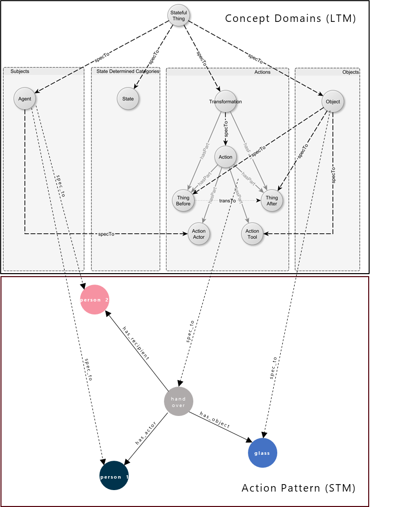

# BasicMemnet

### Introduction

This is a simplified graph implementation of Memory Nets [1], a high-level knowledge representation for intelligent 
agents. The main intention using this memory is to store observations from a physical environment in a situational 
framing. On an abstract level, such a framing always consists of _subjects_, that execute a certain _action_ on 
_objects_ and through this, change _states_ of the involved participants. These four types are called Concept 
Domains which are represented as four independent inheritance hierarchies, as depicted in Figure 1 upper part. As 
Concept Domains are assumed to be long time stable and generally valid, they are indicated as Long Term Memory (LTM),
similar to the TBox.

Each observation is encapsulated into an _Action Pattern_, that extends the basic Concept Domains by further situational 
roles. For example, imagine we have a person 1 (which is of type _Subject_) that hands over (_Action_) a glass (_Object_) to 
another person 2. As person 1 executes the action, it jumps into the role of an actor, while 
it also remains of type _Subject_. Person 2, also of type _Subject_, is now in the role of a receiver, as it is the target 
location of the handed over glass. In this implementation of Memory Nets, such a role is indicated by a dedicated link 
"has_recipient". In the lower part of Figure 1, the resulting Memory Nets graph is illustrated.

<figure>
    
    <figcaption>Figure 1: The four Memory Nets Concept Domains according to [1].</figcaption>
</figure>

### Creating an initial graph

The following sample JSON-file shows how to create an initial Memory Nets Graph as list of dictionaries. Each single dictionary represents
a node in the graph. Nodes can be linked by specifying the parent node attributes. It is necessary to use a unique identifier,
like a uuid or synset - if WordNet is used (cf. [Memory Nets Example](https://github.com/HRI-EU/BasicMemnet/blob/master/examples/example.py#L42)
). You can assign any attributes to the node providing ```node_attributes``` as dictionary.
To ensure a proper reasoning, you **must** use at least the node attributes provided below. Optionally you can attach ```states```
in natural language, like "green" or "tall". 

```json
[
  {
    "link": "spec_to",
    "parent_attributes": {"accessid": ["glass.n.01"]},
    "node_attributes": {
      "type": "object",
      "utterances": ["glass"],
      "timestamp": 1714741106.3516276,
      "memory": "stm",
      "uuid": "658190c06eccd77ab5dc84d4"
    }
  }
]
```

The minimum set of attributes must contain following values:


- **type**: Fixed string value. Allowed values are: "action", "object", "tool", "location", "time", "agent"
- **utterances**: Array of strings. Represents spoken or intended phrases, such as ["glass", "cup", "bottle"]. 
- **timestamp**: Numeric value representing the Unix epoch time when the data was created, e,g, by using time.time().
- **memory**: String. Specifies the type of memory storage to use. Allowed values are: "stm", "ltm" or "mtm"
- **uuid**: String formatted as a universally unique identifier (UUID). Used for unique identification a node.


UUIDs allow for a proper ID management and it is highly recommended to make use of it for linking nodes. You can easiliy create a UUID by 

```python 
from bson import ObjetID
uuid = str(ObjectID())
``` 

### Setup

* pip: `python -m venv venv && source venv/bin/activate && pip install .`
* poetry: `poetry install`

### Example

You can find an example script that loads the action pattern example in examples/example.py. In the constructor, you 
can switch between making use of WordNet or not. By default, it is switched off for a fast initial run. 
You can try this example by running, create_venv.sh is only required once. 

```bash
bash run_example.sh
```

### References
[1] Eggert, J., Deigmoeller, J., Fischer, L., and Richter, A. (2019). Memory Nets: Knowledge representation
for intelligent agent operations in real world. International Joint Conference on Knowledge Discovery, Knowledge 
Engineering, and Knowledge Management. \
[2] Eggert, J., Deigmoeller, J., Fischer, L., and Richter, A. (2020). Action representation for intelligent agents
using Memory Nets. In Communications in Computer and Information Science. \
[3] Deigmoeller, J., Smirnov, P., Wang, C., Takeuchi, J., and Eggert, J. (2022). Situational question answering using 
memory nets. International Joint Conference on Knowledge Discovery, Knowledge Engineering, and Knowledge Management.
